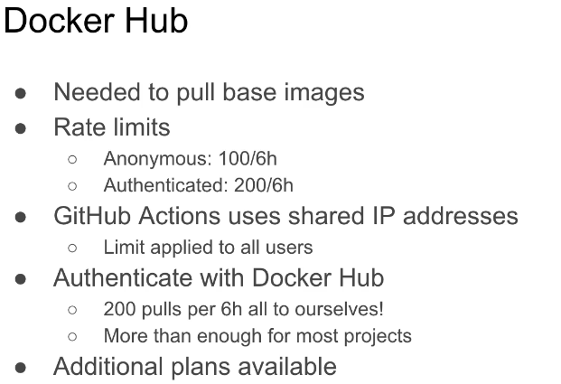

# recipe-app-api

Recipe API Project

# Linting and Testing

## tools to check code formatting

## highlights errors, typos and formatting issues

# How to handle linting

## first install flake8 package

## run it through docker compose

## run this command docker-compose run --rm app sh -c "flake8"

Testing

# Django test suite

# Setup tests per Django app

# Run tests through docker compose

docker-compose run --rm app sh -c "python manage.py test"

Create a Django project

hit this command docker-compose run --rm app sh -c "django-admin startproject app ."

# django-admin startproject app . --> this is a django cli command which is used to create a new project

# docker-compose run --> it will run the newly created project

Run the project with Docker Compose
docker compose up

GitHub Actions:

- It is an automation tool
- Similar to Travis-CI, GitLab CI/CD, Jenkins
- Run jobs when code changes
- Automate tasks

Common usages:

- It handle deployments
- Code linting
- It runs unit tests

# whenever a code is pushed to github i.e the push trigger

# create a job to write the unit test case when the push trigger hits

Configure GitHub Actions

Docker Hub:

allows base images from Docker

basically it hosted service that allows to pull docker images to local machine

Rate limits: it limited the number of images that allow to pull in a certain time frame

