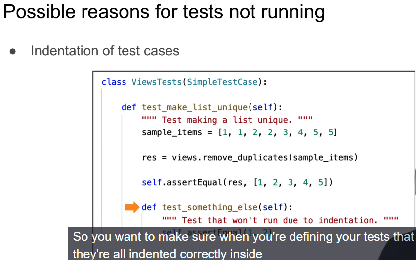

it might wondering why the tests weren't picked up by the test runner properly.

Indentation is really important because that's how it separates different bits of code from other bits of code

Possible reason for Import error

Both test/ directory and tests.py exist

