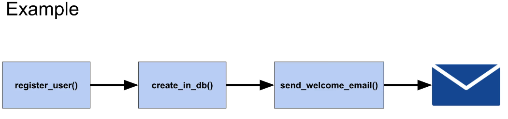
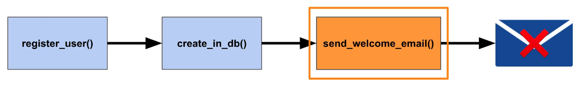
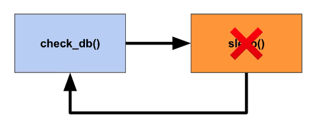
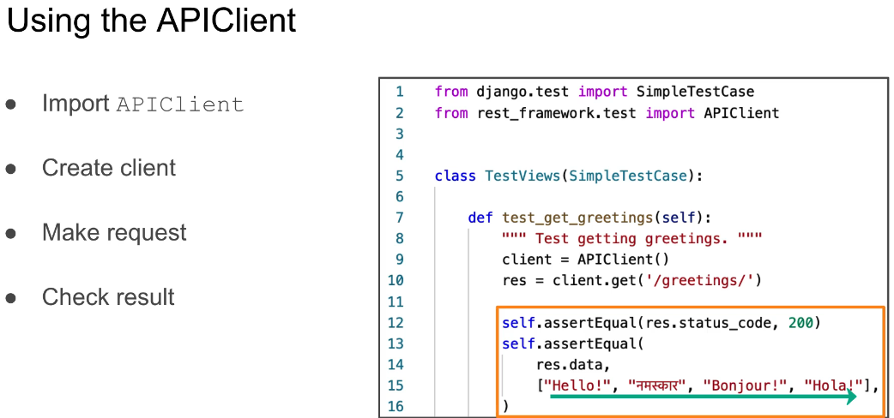

what is Mocking?

- override or change the behavior of dependencies for the purpose of your tests
- Avoid inintended side effects
- isolate specific code being tested by the test case
- Making your test more reliable and accurate

Why use Mocking?

- Avoid relying on external services

  - can't guarantee they will be available when you run unit tests
  - makes tests unpredictable and inconsistent

- Avoid unintended consequences
  - Accidentally sending emails

For example:

once a user is registered in database, send a welcome mail to user. In this scenario, three functions are internally being called.

Now, if we want to test the code, we should avoid actually sending an email to the end user -- this is mocking

So, to mock the send welcome email function and this prevent the email being send to the user. This allow or provides assurance to developer that send_welcome_email() called correctly as per expected situation.

Another benefit

Speed up the tests

Imagine a piece of code to check the databases available and then sleeps for a set of time. So, sleep means wait do nothing and then check that the database is available again.

So, to test this functionality, we should write the code for to sleep() to wait for a set of time and it passes
instantly

How to Mock the code?

- Use unittest.mock library
  - MagicMock/Mock - Replace real object
  - Patch - override code for tests

Testing APIs

- Make actual requests
- Check the result
- Django REST framework APIClient which is based on top of the Django test client that allows you make web request.
- you can make real request to your code and then you can check the result and you can also override any authentication that might have on API

