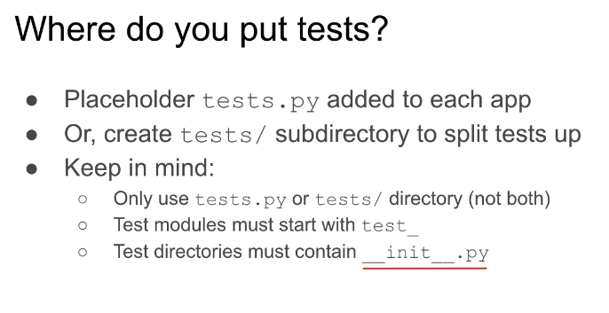
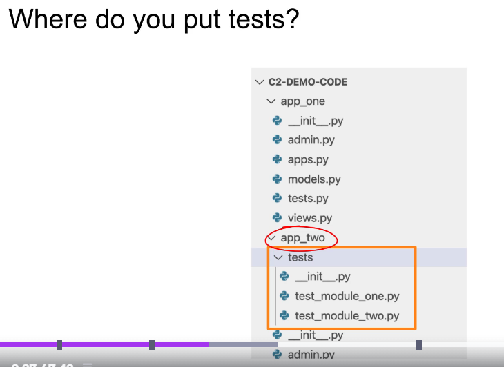
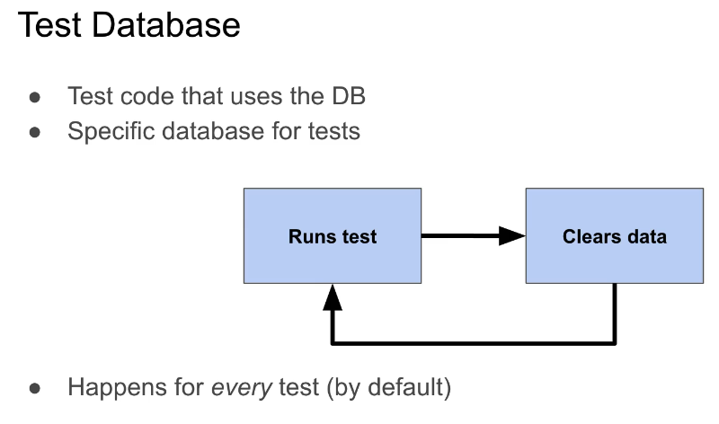
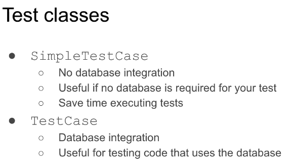
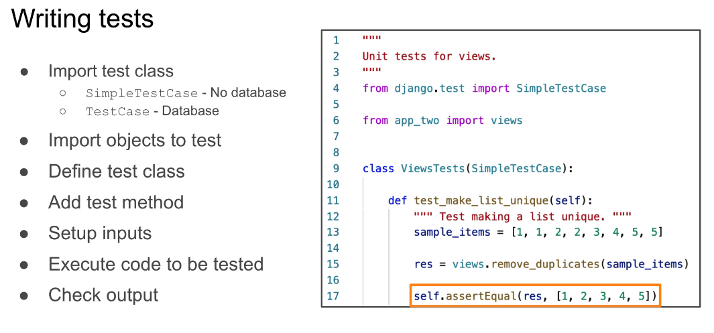

Django test framework

- based on the unittest library
- Django adds features
  - Test client - dummy web browser
  * Simulate authentication
  * temporary database

* add features
  - API test client

**init**.py allows to pick up the tests in test runner

to run tests using Django CLI hit below command

python manage.py test
